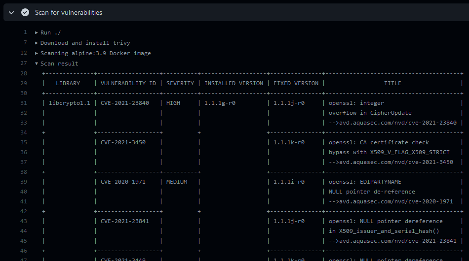
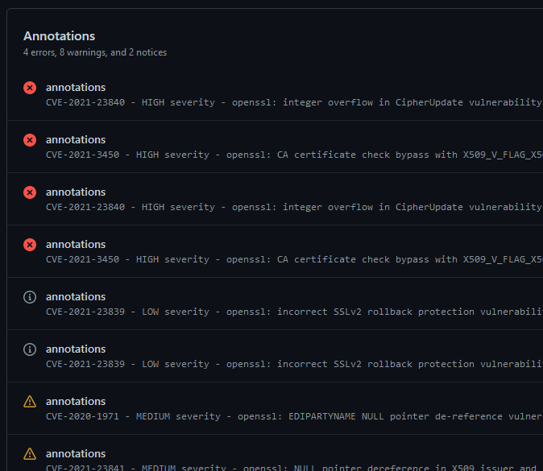

[](https://github.com/crazy-max/docker-scan-action/releases/latest)
[](https://github.com/marketplace/actions/docker-scan)
[](https://github.com/crazy-max/docker-scan-action/actions?workflow=ci)
[](https://github.com/crazy-max/docker-scan-action/actions?workflow=test)
[](https://codecov.io/gh/crazy-max/docker-scan-action)

## :test_tube: Experimental

This repository is considered **EXPERIMENTAL** and under active development
until further notice. It is subject to non-backward compatible changes or
removal in any future version, so you should [pin to a specific tag/commit](https://docs.github.com/en/actions/creating-actions/about-actions#using-tags-for-release-management)
of this action in your workflow.

## About

GitHub Action to check for vulnerabilities in your Docker image with
[Trivy](https://github.com/aquasecurity/trivy).



___

* [Usage](#usage)
  * [Scan image](#scan-image)
  * [Scan tarball](#scan-tarball)
  * [Severity threshold](#severity-threshold)
  * [GitHub annotations](#github-annotations)
  * [Upload to GitHub Code Scanning](#upload-to-github-code-scanning)
  * [Build, scan and push your image](#build-scan-and-push-your-image)
* [Customizing](#customizing)
  * [inputs](#inputs)
  * [outputs](#outputs)
* [Keep up-to-date with GitHub Dependabot](#keep-up-to-date-with-github-dependabot)

## Usage

### Scan image

```yaml
name: ci

on:
  push:

jobs:
  scan:
    runs-on: ubuntu-latest
    steps:
      -
        name: Checkout
        uses: actions/checkout@v2
      -
        name: Build
        uses: docker/build-push-action@v2
        with:
          push: true
          tags: user/app:latest
      -
        name: Scan for vulnerabilities
        uses: crazy-max/docker-scan-action@master
        with:
          image: user/app:latest
```

### Scan tarball

```yaml
name: ci

on:
  push:

jobs:
  scan:
    runs-on: ubuntu-latest
    steps:
      -
        name: Checkout
        uses: actions/checkout@v2
      -
        name: Set up Docker Buildx
        uses: docker/setup-buildx-action@v1
      -
        name: Build
        uses: docker/build-push-action@v2
        with:
          context: .
          outputs: type=oci,dest=/tmp/image.tar
          tags: user/app:latest
      -
        name: Scan for vulnerabilities
        uses: crazy-max/docker-scan-action@master
        with:
          tarball: /tmp/image.tar
```

### Severity threshold

You can define a threshold for severity to mark the job as failed:

```yaml
name: ci

on:
  push:

jobs:
  scan:
    runs-on: ubuntu-latest
    steps:
      -
        name: Checkout
        uses: actions/checkout@v2
      -
        name: Build
        uses: docker/build-push-action@v2
        with:
          push: true
          tags: user/app:latest
      -
        name: Scan for vulnerabilities
        uses: crazy-max/docker-scan-action@master
        with:
          image: user/app:latest
          severity_threshold: HIGH
```


### GitHub annotations

This action is also able to create GitHub annotations in your workflow for
vulnerabilities discovered:

```yaml
name: ci

on:
  push:

jobs:
  scan:
    runs-on: ubuntu-latest
    steps:
      -
        name: Checkout
        uses: actions/checkout@v2
      -
        name: Build
        uses: docker/build-push-action@v2
        with:
          push: true
          tags: user/app:latest
      -
        name: Scan for vulnerabilities
        uses: crazy-max/docker-scan-action@master
        with:
          image: user/app:latest
          annotations: true
```



### Upload to GitHub Code Scanning

This action also supports the [SARIF format](https://docs.github.com/en/code-security/code-scanning/integrating-with-code-scanning/uploading-a-sarif-file-to-github)
for integration with [GitHub Code Scanning](https://docs.github.com/en/github/finding-security-vulnerabilities-and-errors-in-your-code/about-code-scanning)
to show issues in the [GitHub Security](https://docs.github.com/en/repositories/managing-your-repositorys-settings-and-features/enabling-features-for-your-repository/managing-security-and-analysis-settings-for-your-repository)
tab:

```yaml
name: ci

on:
  push:

jobs:
  scan:
    runs-on: ubuntu-latest
    steps:
      -
        name: Checkout
        uses: actions/checkout@v2
      -
        name: Build
        uses: docker/build-push-action@v2
        with:
          push: true
          tags: user/app:latest
      -
        name: Scan for vulnerabilities
        id: scan
        uses: crazy-max/docker-scan-action@master
        with:
          image: user/app:latest
      -
        name: Upload SARIF file
        uses: github/codeql-action/upload-sarif@v1
        with:
          sarif_file: ${{ steps.scan.outputs.sarif }}
```

### Build, scan and push your image

```yaml
name: ci

on:
  push:

jobs:
  scan:
    runs-on: ubuntu-latest
    steps:
      -
        name: Checkout
        uses: actions/checkout@v2
      -
        name: Set up QEMU
        uses: docker/setup-qemu-action@v1
      -
        name: Set up Docker Buildx
        uses: docker/setup-buildx-action@v1
      -
        name: Build for scan
        uses: docker/build-push-action@v2
        with:
          context: .
          load: true
          tags: user/app:latest
      -
        name: Scan for vulnerabilities
        uses: crazy-max/docker-scan-action@master
        with:
          tarball: user/app:latest
      -
        name: Build multi-platform and push
        uses: docker/build-push-action@v2
        with:
          context: .
          platforms: linux/amd64,linux/arm64
          push: true
          tags: user/app:latest
```

## Customizing

### inputs

Following inputs can be used as `step.with` keys

| Name                   | Type     | Description                        |
|------------------------|----------|------------------------------------|
| `trivy_version`        | String   | [Trivy CLI](https://github.com/aquasecurity/trivy) version (default `latest`) |
| `image`                | String   | Docker image to scan (e.g. `alpine:3.7`) |
| `tarball`              | String   | Docker image tarball path to scan |
| `severity`             | String   | Report vulnerabilities of provided level or higher (default: `UNKNOWN,LOW,MEDIUM,HIGH,CRITICAL`) |
| `severity_threshold`   | String   | Defines threshold for severity |
| `annotations`          | Bool     | Create GitHub annotations in your workflow for vulnerabilities discovered |

### outputs

Following outputs are available

| Name              | Type    | Description                           |
|-------------------|---------|---------------------------------------|
| `json`            | File    | JSON format scan result |
| `sarif`           | File    | SARIF format scan result |

## Keep up-to-date with GitHub Dependabot

Since [Dependabot](https://docs.github.com/en/github/administering-a-repository/keeping-your-actions-up-to-date-with-github-dependabot)
has [native GitHub Actions support](https://docs.github.com/en/github/administering-a-repository/configuration-options-for-dependency-updates#package-ecosystem),
to enable it on your GitHub repo all you need to do is add the `.github/dependabot.yml` file:

```yaml
version: 2
updates:
  # Maintain dependencies for GitHub Actions
  - package-ecosystem: "github-actions"
    directory: "/"
    schedule:
      interval: "daily"
```
